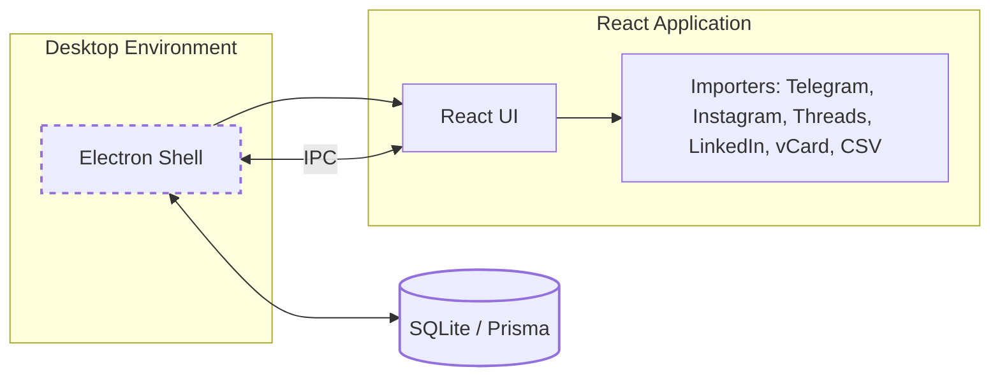

# Onda Contacts 🌊

**A free, local-first personal CRM** — think [Mesh](https://www.meshcrm.com/) or [Dex](https://getdex.com/), but free and with your data on your own device.

Bring everyone you know into one address book by importing your exports from **Telegram, Instagram, Threads, LinkedIn** and your **phone / Google / iCloud contacts**. Onda Contacts merges duplicates across networks, keeps notes and a timeline for every person and reminds you to keep in touch.

### Tech stack

[](https://skillicons.dev)

### Available platforms


## Download

[](https://github.com/OleksandrHridzhak/onda-contacts/actions/workflows/build.yml)

Grab the newest build from **[Releases → latest](https://github.com/OleksandrHridzhak/onda-contacts/releases/tag/latest)**:

- **Windows:** `Onda-Contacts-Setup-*.exe` (installer) or `Onda-Contacts-Portable-*.exe` (runs without installing)
- **Linux:** `Onda-Contacts-*.AppImage` (`chmod +x` and run)

Every push to `main` rebuilds it automatically. Builds are not code-signed yet, so Windows SmartScreen may ask you to confirm (**More info → Run anyway**).

## Features

- 👥 **One address book** — search people by name, company, notes, handles, email or phone; filter by tag, source or favorites.
- 📥 **Imports** (processed locally, nothing is uploaded):

  | Source                  | What to upload                                                      | What you get                                                                                |
  | :---------------------- | :------------------------------------------------------------------ | :------------------------------------------------------------------------------------------ |
  | Telegram                | `result.json` from Telegram Desktop → _Export Telegram data_ (JSON) | Contacts with phones; last message date from personal chats                                 |
  | Instagram               | Meta _Download your information_ `.zip` (JSON)                      | Followers / following / close friends (with a “mutuals only” filter), synced phone contacts |
  | Threads                 | Same Meta `.zip` (Threads section)                                  | Threads followers / following, linked to the Instagram profile                              |
  | LinkedIn                | _Get a copy of your data_ → `Connections.csv` or the `.zip`         | Name, company, position, email, profile URL, connected-on date                              |
  | Phone / Google / iCloud | `.vcf` (vCard 2.1 / 3.0 / 4.0)                                      | Names, phones, emails, company, birthday, social profiles                                   |
  | Any CSV                 | Google / Outlook CSV or your own sheet                              | Mapped by column names                                                                      |

- 🔗 **Smart merge** — records are matched by social handle, email, phone or full name, so the same person from Telegram, LinkedIn and Instagram ends up as one contact. Existing details are never overwritten.
- 🗒️ **Profiles & timeline** — headline, company, socials, tags, “how we met”, notes, and a timeline of calls, meetings, messages and notes.
- 🔔 **Keep in touch** — per-contact cadence (weekly → yearly), overdue reminders, upcoming birthdays and favorites you haven't talked to.
- 🎨 **Themes** — the same palettes, fonts and light/dark mode as the original Onda.
- 📤 **No lock-in** — export everything to CSV at any time.

---

```text
📦 onda-contacts
 ├─ 📁 apps
 │   ├─ 📁 desktop    # Electron shell, SQLite (Prisma) services & IPC
 │   └─ 📁 render     # React UI (contacts, import, reminders, settings)
 ├─ 📁 packages
 │   └─ 📁 shared     # Shared types, importers & contact logic
 └─ 📁 docs         # Documentation & diagrams
```



## Getting Started

Instructions for how to run the project locally.

### Requirements

- Node.js (v20+)
- npm or yarn
- Git Bash (for Windows)
- VS Code (optional)

---

## Installation

1. Clone the repository:

```bash
git clone https://github.com/OleksandrHridzhak/onda-contacts
cd onda-contacts
```

2. Install dependencies in the root folder:

```bash
npm install
```

3. Create the local database (first run, or after schema changes):

```bash
npm run db:push
```

> Upgrading a dev checkout from the old planner schema? Use `npm run db:push -- --force-reset` (this wipes `apps/desktop/prisma/dev.db`). Packaged builds create their tables automatically on start-up.

4. Run the application:

```bash
npm run start
```

5. Run the tests:

```bash
npm test
```

---

## 📄 License

This project is licensed under the MIT License - see the [LICENSE](.github/LICENSE) file for details.
